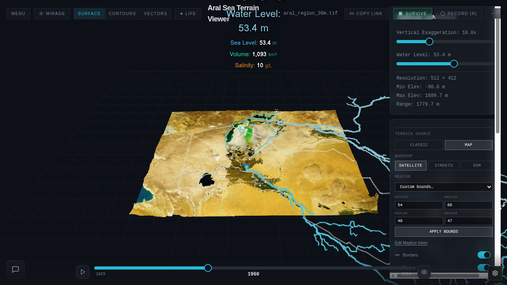

# 2 · Modes & Levels

The app has two modes: **Game** (a series of levels) and **Explore** (a GIS-like tool). Both run on the same 3D terrain and the same data layers.

## Game levels

Navigation between levels:

- **Keyboard / mouse:** click `L1` / `R1` chevrons on the splash, or press the on-screen prev / next pills.
- **Gamepad:** LB = previous level, RB = next level, X / A = begin / dismiss.
- **Touch:** tap chevrons or floating Prev / Next buttons.

| # | Name | What you do | What it teaches |
|---|---|---|---|
| 1 | **Great Water Level** | Drag a single slider to drain or refill the sea; travel through forecast years. | Volume vs. surface area, scale of the drainage. |
| 2 | **Follow the Slope** | Click to pour water; it flows downhill across the real DEM. Place dams and canals. | How terrain dictates hydrology; why the sea sits where it does. |
| 3 | **Satellite GeoGuessr** | A photo appears — tap the map to guess where it was taken (Karavan-Saray Beleuli, Jasliq, Aq Keme, Moynaq, …). | Geography and landmarks of the region. |
| 4 | **Let's play some Minecraft?** | Limited-inventory block-building on the Aral terrain. | Familiar mechanic as an on-ramp to the terrain itself. |
| 5 | **Kegeyli School 12** | First-person walk to School 12; a student waits at the door. | Human scale — what the disaster looks like from the ground. |
| 6 | **Aral Looks Back** | Front-camera face / palm tracking moves the camera; phrases of the Aral fade in. | Reverses the gaze — the landscape watches you. |

Levels are added and tuned over time; the canonical list lives in `src/lib/levels.ts`.

## Explore mode

The default analytical view. All UI is visible; nothing is gamified.

**Top bar:** `MENU · MIRAGE · SURFACE · CONTOURS · VECTORS · LIFE · COPY LINK · RECORD (R)`

**Right panel:**
- Vertical exaggeration
- Water level (m)
- Terrain resolution
- Elevation stats
- Terrain source (Classic / Map)
- Basemap (Satellite / Streets / OSM)
- Region bounds
- Layer toggles (historical basins, rivers, canals, demographic overlays, salinity, groundwater, landcover, schools, …)

**Bottom:** year timeline, 1925 → 2024. Snaps to milestone years (1974, 1989, 1999, 2004, 2009, 2015).

**Top-left HUD:** Sea Level, Volume km³, Salinity g/L — auto-syncs to the timeline year unless overridden by the water-level slider.

**Sharing:** the current camera, year, water level and active layers are encoded in the URL. `COPY LINK` returns a deep link that reproduces the exact view.

**Export:** the `RECORD (R)` button captures the canvas (no UI) as PNG or as a short video.
