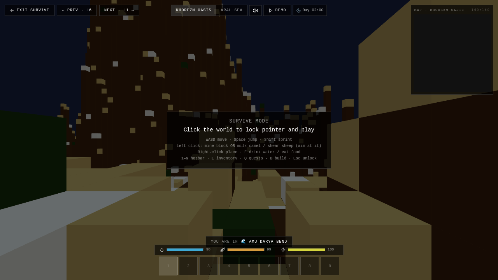

# 2 · Modes & Levels

The app is organized as a numbered series of **levels**, plus a set of standalone **modes** reached from the landing page or the "More Modes" dropdown. Each mode can be located on the two scales described in [philosophy.md](philosophy.md):

- **Engagement:** personal gesture ↔ planetary system
- **Mode:** serious ↔ playful

The modes are not ranked. They are different *models of water* made interactive — a way to ask, of any given action, *what kind of water did this assume?*

Navigation between levels:

- **Keyboard / mouse:** click `L1` / `R1` chevrons on the splash, or press the on-screen prev / next pills.
- **Gamepad:** LB = previous level, RB = next level, X / A = begin / dismiss.
- **Touch:** tap chevrons or floating Prev / Next buttons.

## Levels

| # | Name | What it is |
|---|---|---|
| 1 | **Explore** | Free-camera terrain with all UI: timeline (1925–2024), surface / contour / vector overlays, water-level slider, region bounds, layer toggles. The default sandbox. |
| 2 | **Great Water Level** (Ministry) | A single slider. Drain the sea below −4 m to win. Travel through forecast years. |
| 3 | **Follow the slope** (Water Sim) | Click to pour water; it flows downhill across the real DEM. Tools: dam, canal, water-flow panel. |
| 4 | **Satellite GeoGuessr** | "Where was this photo taken?" Tap the map to guess locations like Karavan-Saray Beleuli, Jasliq, Aq Keme, Moynaq, Muynak. |
| 5 | **Let's play some Minecraft?** | Limited-inventory block-building mode on the Aral terrain. Material palette + clear-all button. |
| 6 | **Kegeyli School 12** | First-person walk to School 12. WASD or auto-walk, a student waits at the door. |
| 7 | **Aral looks back at me** | Front-camera face/palm tracking drives the camera. Phrases of the Aral fade in. |

## Standalone modes

Reachable from the landing page or `More Modes ▾`:

- **Bodies of Water** — 2024 defaults, layer toggles for maternal mortality / landcover / sewage.
- **Ag-MAR Exploration** — managed aquifer recharge proposals with population hex layer.
- **Soap Opera** — Khorezm cottonseed-oil soap tradition, iridescent bubbles, salinity layer.
- **Canal Thinking** — 1960 sea extent, green proposed canals, narrative overlay.
- **Sandbox** — pixel-physics elements (water/sand/fire/plant/lava) painted onto terrain.
- **Dust Storm** — wind-driven particle simulation over the Aralkum seabed.
- **Game of Life** — Conway's cells draped on terrain via `InstancedMesh`.
- **Survive (`/voxel`)** — full Minecraft-like FPS mode on the DEM. Mine, place, craft, camels, sheep, fish, fox, dust devils, day/night cycle, missions. See screenshot below.
- **Bowl World** — standalone 3D level reached from mission 14.
- **Library** (`/library`) — grid of 3D cultural artifacts.

## Guided tours

Self-running overlays that walk through a narrative:

- **Narrative Tour** — 7 cinematic steps, 1960 → 2024.
- **Canal History Tour** — 6 steps, hot-pink highlighting.
- **Ag-MAR Tour** — 7 steps, bottom-strip overlay.
- **River Flyover** — 15 s cinematic low-altitude capture.

## Explore mode in detail

Top bar: `MENU · MIRAGE · SURFACE · CONTOURS · VECTORS · LIFE · COPY LINK · SURVIVE · RECORD (R)`.  
Right panel: vertical exaggeration, water level, resolution, elevation stats, terrain source (Classic / Map), basemap (Satellite / Streets / OSM), region bounds, layer toggles.  
Bottom: year timeline (snaps to milestone years 1974, 1989, 1999, 2004, 2009, 2015).  
Top-left HUD: Sea Level, Volume km³, Salinity g/L — auto-syncs to the timeline year unless manually overridden.
