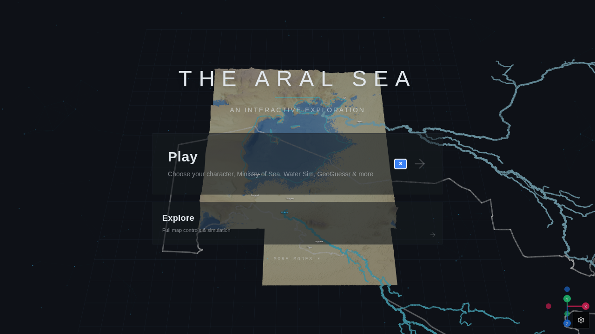

# Aral in 3D — Documentation

**Live site:** https://aral3d.com  
**Preview:** https://aral3d.lovable.app

A data and mapping platform that is also a video game. Real DEM data, historical basin shapes, demographic and climate records, gesture control, multiplayer modes — layered on top of the same Karakalpakstan terrain and turned into something you can play.

## Why this exists

This project begins where Aral School begins: with the question *what water is*. Not where water is, not how much, not how it flows and evaporates — but **what water is imagined to be**, because what we imagine water to be defines how we engage with it.

The Aral Sea is the most famous case of an ecosystem being managed as if it were a clean, external visual object — a polygon on a planner's map. It is not. The project takes the serious data and mapping instrument already developed for the Aral Sea and turns it toward its own limits, its embedded assumptions, its aesthetic defaults and its political imagination.

What we arrived at is a platform where visitors do not simply look at a map of the Aral Sea; they move through it, compete inside it, collaborate with it, flood it, dry it, plant it, reroute it, break it, restore it — and test what kind of water each action assumes.

## Two scales

Every mode in this app can be located on two axes:

- **Engagement scale:** personal gesture ↔ planetary system
- **Mode of engagement:** serious ↔ playful

A local swimming spot is playful and personal. A canal network is serious and planetary. A dam is engineering, geopolitics, **and** a game mechanic. The point is not to make ecological crisis entertaining, but to use play as a way of making complexity graspable without pretending it has become simple.

## Audiences

The platform is designed for schools, museums, festivals, scientists, policymakers, teenagers and casual visitors — not by giving each a separate simplified version, but by allowing different *models of water* to appear through different modes of interaction. It can be a curriculum tool, a museum installation, a speculative policy interface, a science-fair exhibit, and a public storytelling environment all at once.

## Documentation map

| File | Audience | What's inside |
|---|---|---|
| [01-overview.md](01-overview.md) | Everyone | What the app does, who it is for, what it is *not* |
| [philosophy.md](philosophy.md) | Curators / educators | Comparative water-logy, theoretical lineage, the recipe |
| [02-modes-and-levels.md](02-modes-and-levels.md) | Players / educators | Every level and standalone mode, placed on the two scales |
| [03-architecture.md](03-architecture.md) | Developers | Tech stack, render pipeline, data flow |
| [04-data-sources.md](04-data-sources.md) | Researchers / devs | DEMs, GeoJSON, CSVs, audio assets |
| [05-features-deep-dive.md](05-features-deep-dive.md) | Developers | Terrain, water sim, AI scenario chat, voxel world |
| [06-controls.md](06-controls.md) | Players | Keyboard, mouse, gamepad, touch reference |
| [07-development.md](07-development.md) | Contributors | Local setup, scripts, conventions |
| [08-deployment.md](08-deployment.md) | Maintainers | Publishing, custom domain, edge functions |

Screenshots referenced throughout live in [`./screenshots/`](screenshots/).
